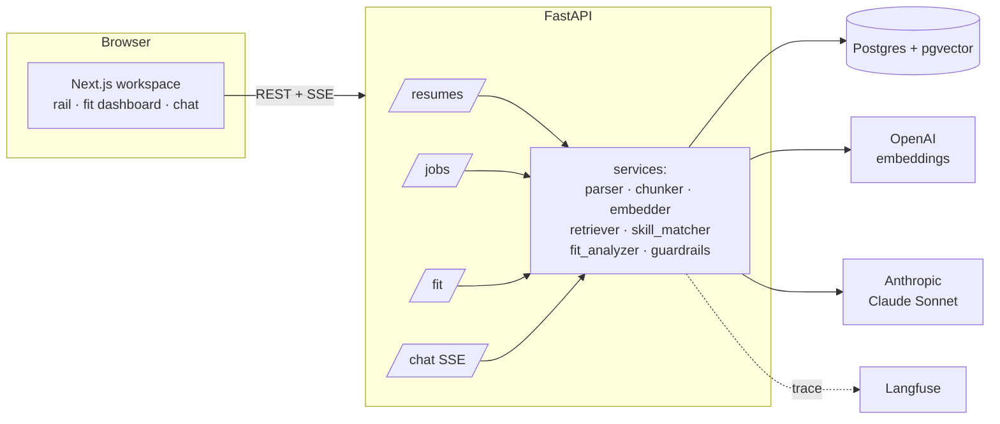

# Career Intelligence Assistant

Analyze a resume against multiple job descriptions: an **explainable** fit score, skill-gap
analysis, auto-generated interview questions, and a grounded chat that cites its sources.

Built for the NewPage take-home (Option 4).

> ✍️ **Note to NewPage reviewers:** the sections marked **✍️ In my words** below are written by me,
> not generated. The brief asked for my thinking and my judgment about where LLM output is and isn't
> appropriate — those sections are where I articulate the *why* behind the build.

---

## Quick setup

**Prerequisites:** Docker + Docker Compose, an OpenAI API key, an Anthropic API key.

```bash
# 1. Configure secrets
cp .env.example .env
#    edit .env → set OPENAI_API_KEY and ANTHROPIC_API_KEY

# 2. Bring up the stack (Postgres+pgvector, FastAPI, Next.js)
docker compose up --build

# 3. In another terminal, seed anonymized demo data (1 resume + 3 jobs)
docker compose run --rm api python seed.py

# 4. Open the app
#    Web UI : http://localhost:3000
#    API docs: http://localhost:8000/docs
```

Run the test suite (no API keys required — all external calls are faked in tests):

```bash
docker compose run --rm api pytest -q     # 21 tests
```

> **Port note:** the dev Postgres is published on host port **5434** (not 5432) so it won't collide
> with an existing local Postgres. Inside the Docker network the database is always `db:5432`, so
> nothing else changes. If host port 3000 or 8000 is already in use on your machine, remap the
> `web`/`api` `ports:` entries in `docker-compose.yml`.

---

## Architecture



**Flow:** Upload a resume (PDF → section-aware chunks → embeddings → pgvector). Add job
descriptions (Claude extracts structured `required_skills`/`nice_to_have`/`seniority` → JSONB;
raw text chunked for chat grounding). Selecting a job computes a deterministic fit score, then
Claude writes a prose summary and tailored interview questions on top of the numbers. The chat
retrieves resume+JD chunks (hybrid vector+keyword) and answers with citations.

Module layout: `api/services/` holds one focused module per responsibility; `api/routers/` exposes
them; `api/prompts/` keeps prompts as versioned files (not buried in code); `web/components/` is one
component per UI surface. See `docs/superpowers/specs/` for the full design spec.

---

## Productionizing (AWS/GCP/Azure)

> ✍️ **In my words** — *Ioannis: replace this with your own take; draft below to react to.*

What I'd change to run this for real:
- **Database:** swap the self-hosted pgvector container for a managed Postgres with pgvector (AWS RDS/Aurora, GCP Cloud SQL) — or a dedicated vector store if scale demanded it. Add an IVFFlat/HNSW index on the `chunks.embedding` column (the demo dataset is tiny, so a flat scan is fine; at >100k chunks an index matters).
- **Object storage:** store uploaded PDFs in S3/GCS, not on the API box; ingest async.
- **Compute:** containers already; deploy api + web on ECS Fargate / Cloud Run behind a load balancer; secrets in a secrets manager, not `.env`.
- **Scale & cost:** cache embeddings (identical chunks shouldn't be re-embedded); batch the embedding calls (already batched per document); add a rate limiter (Redis token bucket) on the chat endpoint.
- **Reliability:** retries/backoff on the LLM/embedding calls; circuit breaker; a fallback "retrieval-only" answer if the LLM is down.
- **Eval in CI:** run the retrieval eval set on every PR and fail the build if recall drops.

## RAG / LLM approach & decisions

> ✍️ **In my words** — *Ioannis: this section is the heart of what they grade. Make the reasoning yours. Factual choices below are accurate; rewrite the prose in your voice.*

| Decision point | Choice | Why |
|---|---|---|
| **Chunking** | Section-aware for resumes (one chunk per Experience/Skills/Education section); recursive ~1800-char windows with overlap for JDs | Resumes are short and highly structured — splitting by section keeps whole bullets intact and lets retrieval filter by section. JDs are prose, so a sliding window is the right default. |
| **Embedding model** | OpenAI `text-embedding-3-small` (1536-dim) | Cheap, fast, strong quality for short text; 1536 dims is plenty for this corpus size. |
| **LLM** | Anthropic Claude Sonnet 4.6 | Best reasoning for the summary + interview-question generation; strong at following the "cite your source" instruction. |
| **Vector DB** | Postgres + pgvector | One store for both relational data and vectors — no second system, no vendor lock-in for a take-home. Honest trade-off: at very large scale I'd revisit a dedicated vector DB and a proper ANN index. |
| **Orchestration** | None — direct SDK calls | Full control over prompt construction, retries, and observability. LangChain's abstractions would hide exactly the parts I want to be able to debug and tune. |
| **Prompt & context mgmt** | Prompts as versioned files in `api/prompts/`; context built with explicit `[resume §section]` / `[JD §jd]` tags | Prompts are diffable and iterable without code changes; the tag format gives the model a citation contract. |
| **Guardrails** | Query length cap, empty-query rejection, PII redaction in logs, "not in your resume" fallback | Cheap, defensible safety; keeps the assistant on-topic and avoids logging personal data. |
| **Quality** | **Deterministic fit score** + a 5-case retrieval eval set in pytest | The score is *computed* (skill coverage + seniority), not invented by the LLM — it's explainable and reproducible. The LLM only writes prose on top. |
| **Observability** | structlog (JSON, request-scoped) + Langfuse tracing + live token/latency in the UI header | You can see per-query cost and latency at a glance, and trace any answer. |

**The decision I care most about:** the fit score is deterministic. `required_coverage*0.5 +
nice_to_have*0.2 + seniority*0.3`, rounded to an integer. The LLM never produces the percentage —
it only writes the summary explaining it. That means the number is defensible, debuggable, and
identical on every run.

## Key technical decisions

> ✍️ **In my words** — *Ioannis: keep/trim these; add anything you'd defend in an interview.*

- Deterministic fit score over an LLM-generated percentage (explainability).
- pgvector over a dedicated vector DB (simplicity, no lock-in at this scale).
- Multi-provider: OpenAI for embeddings, Anthropic for chat (right tool per job).
- No orchestration framework (control + debuggability).
- Injected clients everywhere (`Embedder(client=...)`, `JdParser(client=...)`) so the whole
  pipeline is testable without network access — the 21-test suite runs with zero API keys.

## Engineering standards followed (and skipped)

> ✍️ **In my words** — *Ioannis: this honesty is deliberate; adjust to match what you actually value.*

**Followed:** containerized (one `docker compose up`); typed end-to-end (pydantic + SQLAlchemy 2.0 +
TS strict); tested against a **real** Postgres (no mocked DB) including a retrieval eval set;
structured JSON logging; file-based prompts; secrets via env with a committed `.env.example`.

**Skipped (deliberately, for a take-home) — and what I'd add:**

| Skipped | Why | Production answer |
|---|---|---|
| Multi-user auth | Single-user local app | Auth provider + Postgres row-level security |
| Cloud deploy | Out of scope | Terraform → Fargate/Cloud Run + managed pgvector + S3 |
| CI/CD | Time | GitHub Actions running pytest + the eval set per PR |
| E2E browser tests | Time | Playwright smoke flow |
| Rate limiting | Single user | Redis token bucket on `/chat` |
| ANN vector index | Tiny dataset | HNSW/IVFFlat index once chunk count grows |

## How I used AI tools in development

> ✍️ **In my words — WRITE THIS SECTION YOURSELF.** *Ioannis: the brief asks specifically how you
> use AI coding tools, how you keep it repeatable/maintainable, and your do's & don'ts. This must be
> your real workflow in your own words — do not ship a generated answer here. Bullet prompts to react to:*
> - *Which tool(s) you used and for what (scaffolding/boilerplate/tests vs. design/prompts/scoring logic).*
> - *How you kept the output reviewable — e.g. test-first, small commits, reviewing every diff.*
> - *Where you deliberately did NOT trust the model and wrote/decided yourself (the chunking strategy, the scoring formula, the prompt contracts).*
> - *Your do's & don'ts for AI-assisted work and how you make it repeatable (specs, plans, conventions).*

## What I'd do differently with more time

> ✍️ **In my words** — *Ioannis: make these yours; suggestions to react to:*
> - Per-JD scoring weights and salary normalization.
> - Resume-tailoring suggestions ("rewrite this bullet for JD #2").
> - Hybrid retrieval reranking; an ANN index.
> - A real eval harness with labeled relevance judgments, gated in CI.
> - Streaming the fit analysis, not just the chat.

## Screenshots

> Add 3–5 screenshots to `docs/` and reference them here, e.g.:
> ``

---

## Project layout

```
api/   FastAPI backend — services/, routers/, models/, prompts/, observability/, tests/
web/   Next.js workspace — app/, components/, lib/
docs/  design spec + implementation plan (docs/superpowers/)
docker-compose.yml   db (pgvector) + api + web
```
