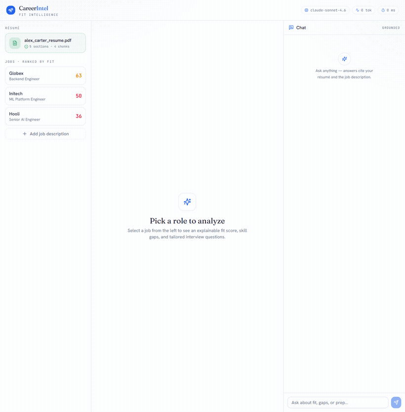
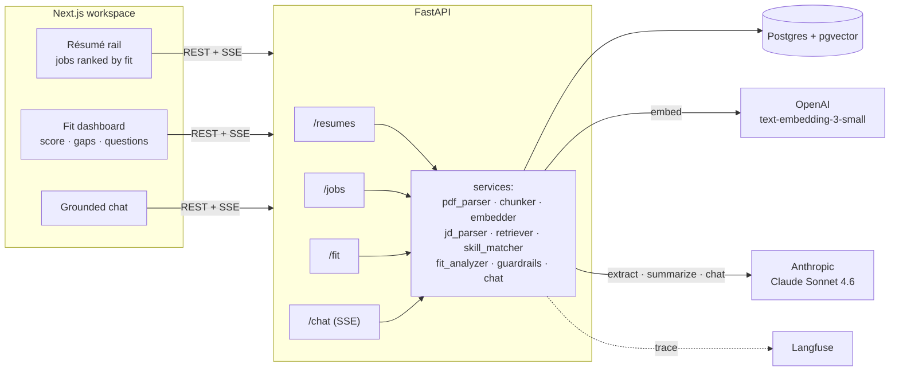
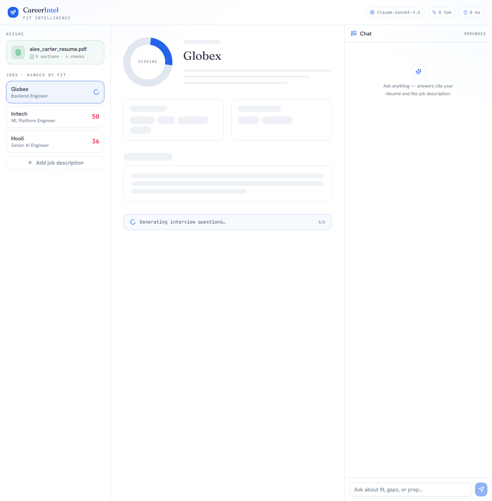
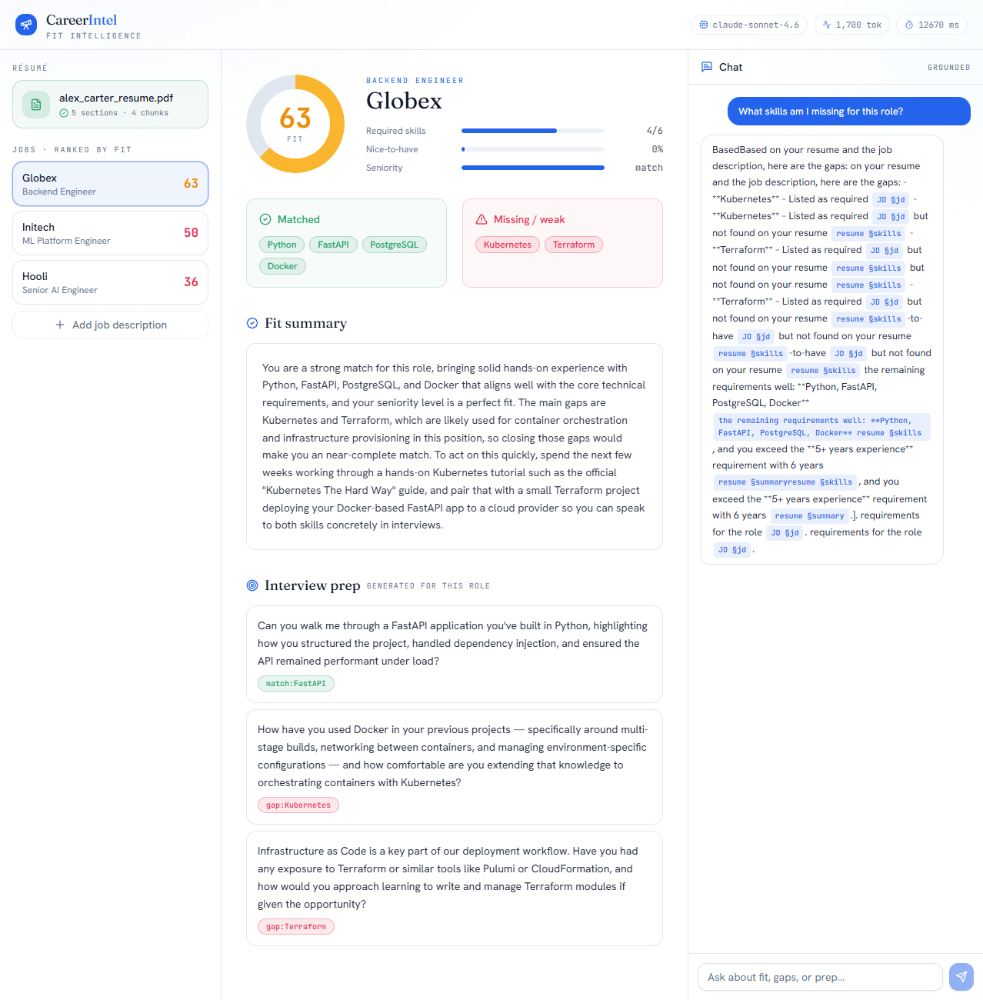

# CareerIntel — Career Intelligence Assistant

Analyze a résumé against multiple job descriptions and get back an **explainable** fit score,
a skill-gap breakdown, tailored interview questions, and a **grounded chat** that cites its
sources. Built for the NewPage take-home (Option 4).



*Pick a job → explainable fit score, skill gaps, and generated interview questions → ask grounded, cited follow-ups.*

> **Note to reviewers:** the sections tagged **✍️ In my words** are written by me, not generated.
> The brief asked for my reasoning and my judgment about where LLM output is and isn't appropriate —
> those sections are where I articulate the *why*.

---

## Table of contents

- [What it does](#what-it-does)
- [Quick start](#quick-start)
- [Architecture](#architecture)
- [Data model](#data-model)
- [The RAG pipeline, step by step](#the-rag-pipeline-step-by-step)
- [Fit scoring: deterministic, not vibes](#fit-scoring-deterministic-not-vibes)
- [Quality, evals & observability](#quality-evals--observability)
- [API reference](#api-reference)
- [Project layout](#project-layout)
- [Testing & CI](#testing--ci)
- [RAG / LLM decisions](#rag--llm-decisions)
- [Key technical decisions](#key-technical-decisions)
- [Engineering standards followed (and skipped)](#engineering-standards-followed-and-skipped)
- [Productionizing](#productionizing)
- [How I used AI tools](#how-i-used-ai-tools-in-development)
- [What I'd do differently with more time](#what-id-do-differently-with-more-time)
- [Screenshots](#screenshots)

---

## What it does

The user is a **job-seeker**. They:

1. **Upload a résumé** (PDF). It's parsed into sections, chunked, embedded, and stored as vectors.
2. **Add job descriptions** (paste text). Claude extracts each one's structured requirements
   (required skills, nice-to-haves, seniority, min years).
3. **Select a job** → see an **explainable fit score**, matched vs. missing skills, a written
   fit summary (addressed to the candidate), and **interview questions** generated for that role.
4. **Chat** → ask anything ("What am I missing for this role?", "How does my experience align?").
   Answers are retrieved from the résumé + JD and **cite the exact source sections**.

The product is intentionally candidate-side; the same engine flips trivially to a recruiter view
(one JD → many résumés) — noted under [what I'd do differently](#what-id-do-differently-with-more-time).

---

## Quick start

**Prerequisites:** Docker + Docker Compose, an OpenAI API key, an Anthropic API key.

```bash
# 1. Configure secrets
cp .env.example .env
#    edit .env → set OPENAI_API_KEY and ANTHROPIC_API_KEY

# 2. Build & start the stack (Postgres+pgvector, FastAPI, Next.js)
docker compose up --build

# 3. In another terminal, seed anonymized demo data (1 résumé + 3 jobs, fit precomputed)
docker compose run --rm api python seed.py

# 4. Open the app
#    Web UI  : http://localhost:3000
#    API docs: http://localhost:8000/docs   (interactive Swagger)
```

**Run the tests** (the unit + retrieval suite needs no API keys — all external clients are faked):

```bash
docker compose run --rm api pytest -q -m "not eval"   # 21 tests, no keys
docker compose run --rm api pytest -q                  # 22 tests, incl. live LLM-judge eval
```

> **Port note:** Postgres is published on host port **5434** (not 5432) to avoid colliding with a
> local Postgres. Inside the Docker network the DB is always `db:5432`, so `DATABASE_URL` is
> unaffected. If host port 3000/8000 is taken, remap the `web`/`api` `ports:` in
> `docker-compose.yml` and set `NEXT_PUBLIC_API_URL` to match.

---

## Architecture



Three containers, one command. The frontend talks to the API over REST + Server-Sent Events
(for token streaming). The API owns all retrieval, scoring, and orchestration; it calls OpenAI for
embeddings and Anthropic for extraction/summarization/chat. Postgres with the `pgvector` extension
stores both the relational data and the embeddings — one datastore, no second system.

---

## Data model

Five tables (`api/models/`):

| Table | Purpose | Notable columns |
|---|---|---|
| `resumes` | uploaded résumé | `raw_text`, `parsed_sections` (JSONB) |
| `jobs` | a job description | `raw_text`, `parsed_jd` (JSONB: skills, seniority, min_years) |
| `chunks` | embedded text units | `source_type` (resume\|job), `section`, `content`, `embedding VECTOR(1536)` |
| `fit_analyses` | a résumé×job result | `fit_score`, `matched_skills`, `missing_skills`, `sub_scores`, `summary` |
| `queries` | chat audit log | `question`, `retrieved_chunk_ids`, `latency_ms`, `tokens_used` |

JD extraction and résumé parsing happen **once at ingestion** and are stored as JSONB, so reads
never re-parse. `fit_analyses` is persisted, which is what lets the rail show scores on page load.

---

## The RAG pipeline, step by step

**Ingesting a résumé** (`services/pdf_parser.py`, `chunker.py`, `embedder.py`):
1. `pypdf` extracts text; a heading regex splits it into sections (Summary, Experience, Skills,
   Education, …).
2. **Section-aware chunking** — one chunk per section. Résumés are short and structured, so this
   keeps whole bullets intact and lets retrieval filter by section.
3. OpenAI `text-embedding-3-small` embeds the chunks in a single batched call (token count tracked).
4. Chunks + 1536-dim vectors are written to `pgvector`.

**Ingesting a job** (`services/jd_parser.py`):
1. One Claude call converts the messy JD prose into structured JSON
   (`required_skills`, `nice_to_have`, `responsibilities`, `seniority`, `min_years`) → stored as JSONB.
2. The raw JD is also recursively chunked + embedded so the chat can ground answers in it.

**Retrieval** (`services/retriever.py`):
- **Hybrid**: pgvector cosine distance for semantic recall **plus** an `ILIKE` keyword pass for
  exact-token precision (e.g. "Kubernetes"), filtered to the active résumé + selected job.

**Chat** (`services/chat.py`, `routers/chat.py`):
- Retrieved chunks are formatted with explicit `[resume §section]` / `[JD §section]` tags. The system
  prompt requires the model to cite those tags after each claim and to say *"that isn't in your
  résumé / the job description"* when retrieval is empty (anti-hallucination). Tokens stream to the
  UI over SSE; the frontend renders the citation tags as chips.

---

## Fit scoring: deterministic, not vibes

The headline number is **computed**, not produced by an LLM. `services/fit_analyzer.py`:

```
required_coverage  = matched_required / total_required        (weight 0.5)
nice_to_have_cover = matched_nice     / total_nice            (weight 0.2)
seniority_match    = 1.0 if resume_years >= jd_min_years
                     else resume_years / jd_min_years         (weight 0.3)

fit_score = round(100 * (0.5·required + 0.2·nice + 0.3·seniority))
```

Skill matching (`services/skill_matcher.py`) is itself hybrid: a keyword check first, then a cosine
similarity fallback against the résumé's skill vectors (so "Container orchestration" can match
"Kubernetes"). The LLM only writes the **prose summary** and the **interview questions** *on top of*
these numbers — it never invents the percentage. The result is explainable ("63 = 4/6 required +
0/4 nice-to-have + full seniority"), reproducible across runs, and debuggable.

---

## Quality, evals & observability

- **Retrieval-recall eval** (`tests/test_eval.py`) — a fixture of question→expected-section cases
  asserts retrieval recall ≥ 0.8.
- **LLM-as-judge groundedness gate** (`evals/judge.py`, `tests/test_llm_judge.py`) — a separate,
  cheap Claude call scores each chat answer's faithfulness to the retrieved context on a 1–5 rubric;
  the suite fails if the average drops below threshold. This runs in CI when secrets are present and
  auto-skips locally when keys are absent.
- **Guardrails** (`services/guardrails.py`) — query length cap, empty-query rejection, and PII
  redaction (emails/phones) before anything is logged.
- **Observability** — `structlog` emits JSON logs with a per-request id; **Langfuse** tracing wraps
  the chat call (degrades to a no-op when unconfigured); and the UI header shows live
  `model · tokens · latency` so cost is visible at a glance.

---

## API reference

| Method | Path | Purpose |
|---|---|---|
| `POST` | `/resumes` | Upload a résumé PDF → parse, chunk, embed |
| `GET`  | `/resumes/latest` | Most recently uploaded résumé (powers auto-load) |
| `POST` | `/jobs` | Add a job → extract structured JD, chunk, embed |
| `GET`  | `/jobs?resume_id=` | List jobs, with persisted fit scores for that résumé |
| `POST` | `/fit/{resume_id}/{job_id}` | Compute fit + summary + interview questions |
| `POST` | `/chat` | Grounded chat (SSE token stream) |
| `GET`  | `/health` | Liveness |

Full interactive docs at `http://localhost:8000/docs`.

---

## Project layout

```
newpage-career-intel/
├── docker-compose.yml            # db (pgvector) + api + web, one command
├── .github/workflows/ci.yml      # lint + unit + eval gate
├── api/
│   ├── app.py  config.py  db.py  seed.py
│   ├── models/                   # SQLAlchemy: resume, job, chunk, fit, query
│   ├── routers/                  # resumes, jobs, fit, chat (SSE)
│   ├── services/                 # one module per responsibility (see pipeline above)
│   ├── prompts/                  # versioned .txt prompts (not buried in code)
│   ├── evals/judge.py            # LLM-as-judge groundedness scorer
│   └── tests/                    # 22 tests + fixtures + eval set
├── web/
│   ├── app/                      # Next.js App Router (layout, page, globals)
│   ├── components/               # ResumeUpload, JobList, FitDashboard, ChatPanel, …
│   │   └── ui/                   # shadcn/ui primitives
│   └── lib/                      # typed API client, SSE reader, types
└── docs/                         # screenshots + design spec & plan
```

---

## Testing & CI

- **22 tests.** The 21 unit/integration/retrieval tests run against a **real** Postgres (no mocked
  DB) with faked LLM/embedding clients — so they need zero API keys. The 22nd is the live
  LLM-as-judge eval, marked `eval` and auto-skipped without keys.
- **GitHub Actions** (`.github/workflows/ci.yml`): spins up a pgvector service, runs `ruff`, then
  `pytest -m "not eval"`, then the LLM-judge eval **only when** `OPENAI_API_KEY` + `ANTHROPIC_API_KEY`
  secrets are configured.

```bash
docker compose run --rm api ruff check .              # lint
docker compose run --rm api pytest -q -m "not eval"   # fast, no keys
docker compose run --rm api pytest -q                 # full, incl. eval
```

---

## RAG / LLM decisions

<!-- DRAFT — edit to match your voice. -->

My guiding constraint was the brief's own line: a solid, well-engineered basic solution beats an
over-engineered complex one. So at every fork I picked the option I could *explain and defend*, not
the most impressive-sounding one. The table below is the short version; the paragraph under it is the
one decision I'd lead with in an interview.

| Decision | Choice | Why |
|---|---|---|
| **Chunking** | Section-aware for résumés; recursive windows for JDs | Résumés are short + structured → section chunks keep bullets whole and enable section-filtered retrieval. JDs are prose → sliding window. |
| **Embeddings** | OpenAI `text-embedding-3-small` (1536-d) | Cheap, fast, strong for short text at this corpus size. |
| **LLM** | Anthropic Claude Sonnet 4.6 | Strong reasoning for extraction + summaries; follows the "cite your source" contract reliably. |
| **Vector store** | Postgres + pgvector | One datastore for relational + vectors; no second system, no lock-in for a take-home. |
| **Orchestration** | None — direct SDK calls | Full control over prompts, retries, observability; no framework abstraction to debug through. |
| **Prompts** | Versioned `.txt` files | Diffable, iterable without code changes. |
| **Context** | Explicit `[source §section]` tags | Gives the model a citation contract the UI can render. |
| **Guardrails** | Length cap, PII redaction, "not in context" fallback | Cheap, defensible safety; keeps it on-topic. |
| **Quality** | Deterministic score + retrieval-recall eval + LLM-judge gate | Score is computed & explainable; answers are scored for faithfulness, gated in CI. |

**The decision I'd lead with:** the fit score is deterministic. It's `0.5·required + 0.2·nice +
0.3·seniority`, rounded to an integer — the LLM never produces the number, it only writes the prose
that explains it. I made this choice because an LLM-generated "73% fit" is unfalsifiable: you can't
debug it, it drifts between runs, and you can't defend it to a user. By computing it from skill
coverage and seniority, the score is reproducible, traceable to its inputs ("63 = 4 of 6 required
skills + no nice-to-haves + a full seniority match"), and the LLM is used for what it's actually good
at — turning those numbers into readable advice. That split (deterministic math for the verdict,
generative text for the explanation) is the single idea I'd want a reviewer to take away.

---

## Key technical decisions

<!-- DRAFT — edit to match your voice. -->

A few choices I'd be ready to defend, beyond the scoring decision above:

- **Deterministic fit score over an LLM-generated percentage.** Explainability and reproducibility —
  see the paragraph above.
- **pgvector over a dedicated vector DB (Pinecone/Weaviate/etc.).** At this corpus size a second
  system buys nothing and costs operational complexity and lock-in. One Postgres holds the relational
  data *and* the vectors, and a take-home reviewer can run it with zero external accounts. I note
  the honest limit: past roughly 100k+ chunks I'd add an ANN index and re-evaluate a dedicated store.
- **Multi-provider: OpenAI for embeddings, Anthropic for chat.** I used each provider for what it's
  strongest and cheapest at rather than forcing one vendor end-to-end. The cost is a second SDK; the
  benefit is the right tool per job and no single point of vendor failure.
- **No orchestration framework (LangChain/LlamaIndex).** The pipeline is small enough that a framework
  would hide the exact things I want to control and debug — prompt construction, retry behavior, and
  what actually gets sent to the model. Direct SDK calls keep the data flow obvious.
- **Dependency-injected clients everywhere** (`Embedder(client=…)`, `JdParser(client=…)`,
  `ChatService(client=…)`). This is what makes the whole pipeline testable without network access:
  the 21-test unit suite runs with zero API keys by passing fakes, and the same seams let the
  LLM-as-judge eval run the *real* clients in CI.

---

## Engineering standards followed (and skipped)

<!-- DRAFT — edit to match your voice. -->

I tried to be deliberate about what to invest in and equally deliberate about what to leave out —
listing the gaps is part of the engineering, not an admission against it.

**Followed:** containerized so a reviewer runs the whole thing with one `docker compose up`; typed
end-to-end (pydantic + SQLAlchemy 2.0 on the backend, TypeScript strict on the frontend); tested
against a **real** Postgres (no mocked DB) so the tests exercise actual SQL and the pgvector column,
including a retrieval-recall eval **and** an LLM-as-judge groundedness gate; **GitHub Actions CI**
running lint + unit + eval; structured JSON logging with a per-request id; prompts kept as versioned
files rather than buried in code; and secrets via env with a committed `.env.example`.

**Skipped deliberately — and what I'd add:**

| Skipped | Why | Production answer |
|---|---|---|
| Multi-user auth | Single-user local app | Auth provider + Postgres row-level security |
| Cloud deploy | Out of scope | Terraform → Fargate/Cloud Run + managed pgvector + S3 |
| E2E browser tests | Time | Playwright smoke flow |
| Rate limiting | Single user | Redis token bucket on `/chat` |
| ANN vector index | Tiny dataset | HNSW/IVFFlat index once chunk count grows |

---

## Productionizing

<!-- DRAFT — edit to match your voice. -->

What I'd change to run this for real, roughly in the order I'd tackle it:

- **Database:** managed Postgres+pgvector (RDS/Aurora, Cloud SQL); add an HNSW index on
  `chunks.embedding` once the corpus grows past a flat-scan-friendly size.
- **Storage:** uploaded PDFs to S3/GCS, ingested async (queue + worker), not on the API box.
- **Compute:** api + web on ECS Fargate / Cloud Run behind a load balancer; secrets in a manager.
- **Cost/scale:** cache embeddings (skip re-embedding identical chunks); rate-limit `/chat`.
- **Reliability:** retries/backoff + circuit breaker on LLM calls; retrieval-only fallback if the
  LLM is down.
- **Quality in CI:** run both evals per PR and block merges on regression.

---

## How I used AI tools in development

<!-- DRAFT — this section is graded on YOUR authenticity. Read it, then rewrite it as how *you*
     actually work. The version below is a reasonable starting point, not gospel. -->

I treated the AI assistant as a fast pair-programmer, not an autopilot. The workflow was
**spec → plan → small, test-backed increments**, and I reviewed every diff before it landed.

**Where I leaned on AI:** scaffolding (the FastAPI/Next.js skeletons, Docker wiring), boilerplate
(SQLAlchemy models, pydantic schemas, the shadcn component setup), and first-pass tests. These are
high-volume, low-judgment, and easy to verify by running them — exactly where AI earns its keep.

**Where I deliberately didn't trust it and decided myself:** the parts that need domain judgment and
that I'd have to defend later — the **section-aware chunking strategy**, the **deterministic scoring
formula and its weights**, and the **prompt contracts** (the citation-tag format, the JD-extraction
JSON shape). I had AI draft, but I owned the decision and the wording. When a model proposed adding
LangChain or a heavier abstraction, I pushed back — that's the kind of "looks senior" complexity the
brief warns against.

**How I keep it repeatable and maintainable:**
- A written spec and a task plan up front, so generation has a target instead of wandering.
- TDD on the core logic — tests defined the contract, the model filled in the implementation, and a
  red test caught it when the implementation was wrong.
- Small commits with clear messages, each one independently reviewable.
- Dependency injection so AI-written code stays testable without live API calls.
- Linting + CI as a backstop, so nothing the model wrote merges unless it passes.

**My do's & don'ts:**
- **Do** give it tight, testable units and verify by running, not by reading.
- **Do** make it explain trade-offs, then make the call yourself.
- **Don't** let it choose architecture or invent metrics — those are mine to own.
- **Don't** ship anything I can't explain in an interview.

---

## What I'd do differently with more time

<!-- DRAFT — edit to match your voice. -->

In priority order:

- Recruiter view (one JD → many résumés ranked by candidate) — same engine, flipped.
- Résumé tailoring: "rewrite this bullet to close the gap for JD #2," with a diff view.
- Gap → learning plan generator.
- Hybrid retrieval reranking + an ANN index.
- Stream the fit analysis (today only the chat streams).
- A labeled relevance-judgment eval harness, gated in CI.

---

## Screenshots

**Fit dashboard** — explainable score, skill gaps, candidate-voice summary, generated questions:



**Grounded chat** — answers cite the résumé and the job description:


